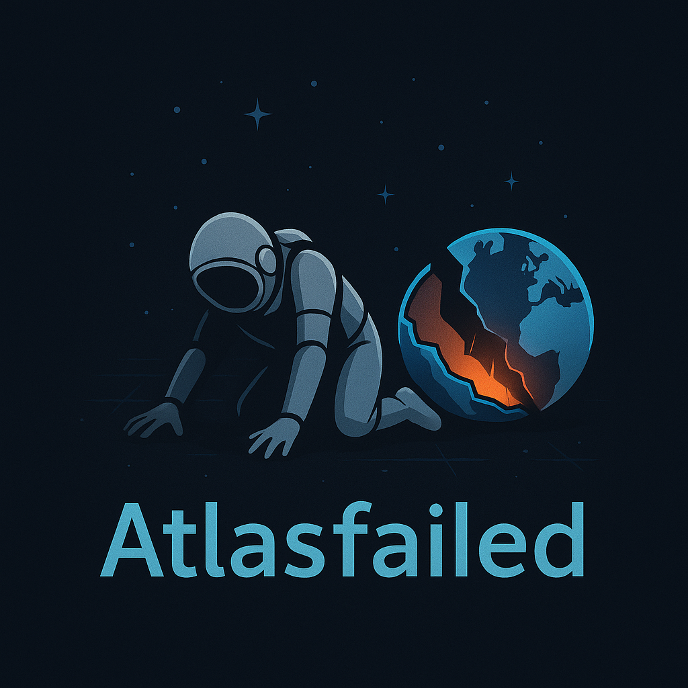

# BAR Nation Leaderboard System

A comprehensive web application for displaying Beyond All Reason (BAR) player and nation rankings with real-time leaderboards and advanced analytics.



## 🌟 Features

### 🏆 **Player Leaderboard**
- Global and country-specific rankings
- Multiple game types (Duel, Small Team, Large Team, etc.)
- Real-time search functionality
- Performance ratings with 2-decimal precision
- Fast API responses with data preprocessing

### 🌍 **Nation Rankings** 
- Confidence Factor algorithm for fair nation scoring
- Dynamic K-factor based on games played
- Minimum games threshold filtering
- Detailed explanations with collapsible info sections
- Top player contributions per nation

### ⚡ **Performance Optimized**
- Pre-processed data for sub-100ms API responses
- Hardware-accelerated CSS rendering
- Document fragment optimization for large tables
- Caching system for instant leaderboard access

### 🔄 **Data Pipeline**
- Automated BAR replay data processing
- Scheduled updates (Tuesdays & Saturdays at 10:00 AM)
- Nationality mapping and player tracking
- Comprehensive error handling and logging

## 🚀 Quick Start

### Local Development

1. **Clone the repository**
   ```bash
   git clone git@github.com:Atlasfailed/bar_leaderboard.git
   cd bar_leaderboard
   ```

2. **Install dependencies**
   ```bash
   pip install -r requirements.txt
   ```

3. **Run the data pipeline** (requires BAR replay data)
   ```bash
   ./run_pipeline_local.sh
   ```

4. **Start the web application**
   ```bash
   python app.py
   ```

5. **Open in browser**
   ```
   http://localhost:5010
   ```

### Production Deployment (PythonAnywhere)

See detailed deployment instructions in [`DEPLOYMENT_GUIDE.md`](DEPLOYMENT_GUIDE.md)

## 📊 API Endpoints

### Status & Meta
- `GET /api/status` - System status and last update time
- `GET /api/leaderboards` - Available nations and regions

### Player Leaderboards
- `GET /api/leaderboard/global/<game_type>` - Global rankings
- `GET /api/leaderboard/<country_code>/<game_type>` - Country rankings

### Nation Rankings
- `GET /api/nation-rankings/<game_type>` - Nation rankings with confidence scores

## 🏗️ Architecture

### Backend (Flask)
- **`app.py`** - Main Flask application with optimized API endpoints
- **`nation_ranking_pipeline.py`** - Data processing pipeline
- **`wsgi.py`** - WSGI configuration for production deployment

### Frontend (Vanilla JS + CSS)
- **Player Leaderboard** - Interactive rankings with search
- **Nation Rankings** - Confidence Factor explanations
- **Responsive Design** - Mobile-friendly dark theme

### Data Processing
- **Confidence Factor Algorithm** - Fair nation ranking system
- **Dynamic K-Factor** - Adaptive scoring based on experience
- **Vectorized Operations** - High-performance pandas processing

## 🎮 Game Types Supported

- **Duel** - 1v1 matches
- **Small Team** - 2v2, 3v3 matches  
- **Large Team** - 4v4+ matches
- **Battle Royale** - Free-for-all matches
- **And more** - Automatically detected from replay data

## 📈 Performance Metrics

- **API Response Times**: 7-90ms (vs. 2000ms+ before optimization)
- **Data Processing**: 204 leaderboard combinations pre-cached
- **Memory Usage**: Optimized with document fragments and GPU acceleration
- **Update Schedule**: Bi-weekly (Tuesdays & Saturdays at 10:00 AM UTC)

## 🛠️ Technical Stack

- **Backend**: Python, Flask, Pandas, Flask-CORS
- **Frontend**: HTML5, CSS3, Vanilla JavaScript
- **Deployment**: PythonAnywhere, WSGI
- **Data**: Parquet files, CSV mappings
- **Performance**: Document fragments, CSS transforms, data preprocessing

## 📝 Data Sources

- BAR replay files (JSON format)
- ISO country code mappings
- Player nationality database
- Match history and ratings

## 🤝 Contributing

1. Fork the repository
2. Create a feature branch: `git checkout -b feature-name`
3. Make your changes and test locally
4. Commit your changes: `git commit -m 'Add feature'`
5. Push to the branch: `git push origin feature-name`
6. Submit a pull request

## 📄 License

This project is open source and available under the [MIT License](LICENSE).

## 🎯 Future Enhancements

- [ ] Real-time WebSocket updates
- [ ] Player profile pages with detailed statistics
- [ ] Historical ranking charts and trends
- [ ] Tournament bracket integration
- [ ] Advanced filtering and sorting options
- [ ] Export functionality (CSV, JSON)
- [ ] Multi-language support

## 🐛 Issues & Support

If you encounter any issues or have suggestions:

1. Check existing [Issues](https://github.com/Atlasfailed/bar_leaderboard/issues)
2. Create a new issue with detailed description
3. Include error logs and system information

## 🙏 Acknowledgments

- Beyond All Reason community for game data
- Contributors and testers
- Flask and Pandas development teams

---

**Built with ❤️ for the BAR community**

*Last updated: June 2025*
